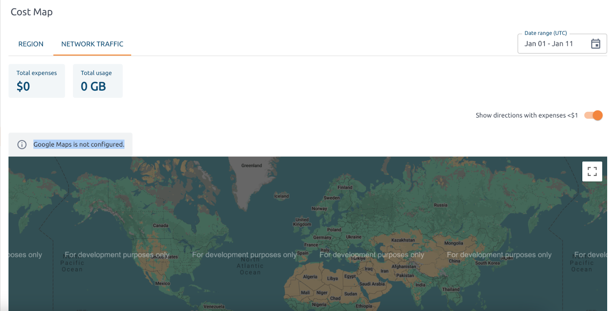

# How to connect Google Maps

This image on the Cost Map page indicates that Google Maps is not correctly set up.



Follow the instructions to fix it:

1\. To configure Google Maps, specify the `google_map_api_key` parameter in your [user_template.yml](https://github.com/hystax/optscale/blob/integration/optscale-deploy/overlay/user_template.yml#L98) file.

2\. Update your cluster with the new overlay:

```
./runkube.py --with-elk -o overlay/user_template.yml -- <deployment name> <version>
```

> [!NOTE] 
> If you have a custom changes, use the `--no-pull` flag in step 2, as shown below:
> 
> `./runkube.py -o overlay/user_template.yml --with-elk --no-pull -- <deployment name> local`

3\. Obtain the value of `google_map_api_key` in the Google Cloud Console: go to the section *APIs & Services* → *Credentials* → *CREATE CREDENTIALS* → *API key*.
