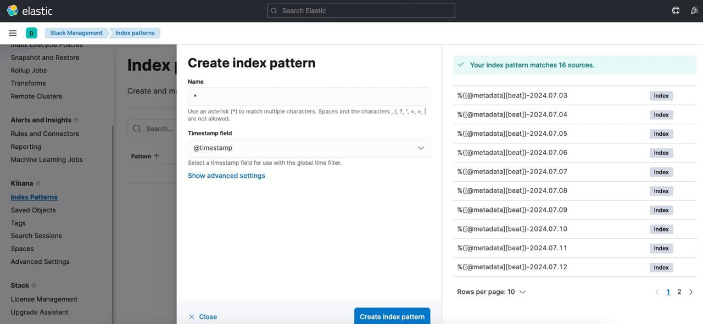

# Kibana logs

This guide is intended to help users navigate Kibana to view logs when encountering issues. By following the outlined steps, you’ll be able to efficiently access and analyze log data, enabling you to identify and troubleshoot potential problems.

1. Open http://cluster_ip:30081
2. Use the username and password from your own user_template.yaml file ([optscale/optscale-deploy/overlay/user_template.yml](../optscale-deploy/overlay/user_template.yml#L102))
3. Go to the **Discover** tab
4. Filter the data by container name `name: *<container_name>*`
5. Add a **message** filter.

> [!NOTE] 
> If kibana prompts you to create an index pattern, create it with the following parameters:
> 

**Troubleshooting**

If address `http://cluster_ip:30081` is not available, ensure that you used the `--with-elk` flag on cluster installation step ([GitHub - hystax/optscale](https://github.com/hystax/optscale/tree/integration?tab=readme-ov-file#cluster-update))  and `elk-0` pod in the running state.
